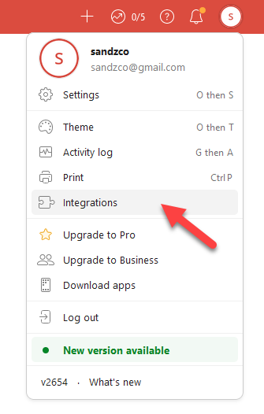
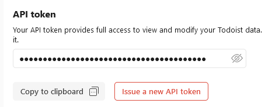
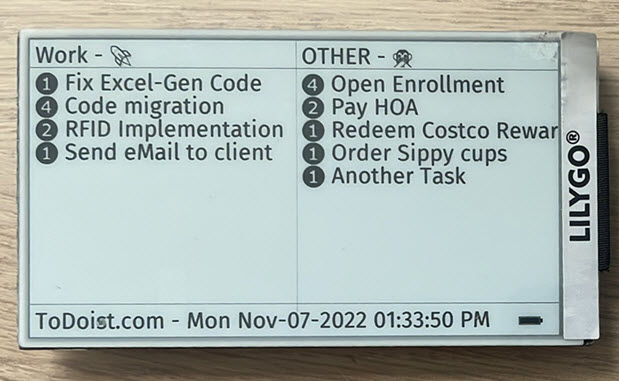

# ESP32-EPD47-ToDoist-Display 
## LilyGo T5 4.7 ePaper display for Todoist.com

1.) Buy yoursellf LilyGo T5 4.7 EPD47 ePaper display. 
2.) Install Arduino and related libraries. See  Xinyuan-LilyGO /LilyGo-EPD47. 
3.) Clone this repo. 
4.) Edit owm_credentials.h  
&nbsp;&nbsp;&nbsp;&nbsp;a.) with your Wifi and password 
&nbsp;&nbsp;&nbsp;&nbsp;b.) API integration key from ToDoist.com 
&nbsp;&nbsp;&nbsp;&nbsp;c.) Preffered Project and Section to show on the left side. 
5.) Upload to device and enJoy!! 

Some code has been reused from Xinyuan-LilyGO/ LilyGo-EPD-4-7-OWM-Weather-Display

## Support ToDoist.com to help keep these APIs running!

